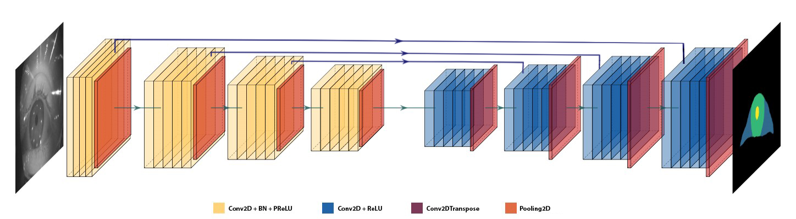

## EyeSeg: Fast and Efficient Few-Shot Semantic Segmentation

#### Key Topics:

> OpenEDS 2020, Semantic Segmentation, lightweight model, real-time, encoder-decoder, Sparsely Annotated Data.

#### BibTex:
<pre>
@InProceedings{perryECCV2020SparSeg,
author = {Perry, Jonathan and Fernandez, Amanda},
title = {EyeSeg: Fast and Efficient Few-Shot Semantic Segmentation},
booktitle = {European Conference on Computer Vision (ECCV) Workshops},
month = {Aug},
year = {2020}
}
</pre>

---

#### Model Architecture:

#### Train with OpenEDS 2020 Dataset for Sparse Semantic Segmentation:
<pre>python3 train.py --command-one=cmdone --command-two=cmdtwo</pre>

#### Requirements:
> <i> This is a basic list, where more dependencies might be required</i>...[<b>See requirements.txt</b>](https://github.com/dcjmp90/SparSeg/blob/master/utils/requirements/requirements.txt)
<pre>
Pillow 7.1
tf-nightly-gpu 2.2
opencv-python 4.2
numpy 1.18
</pre>
